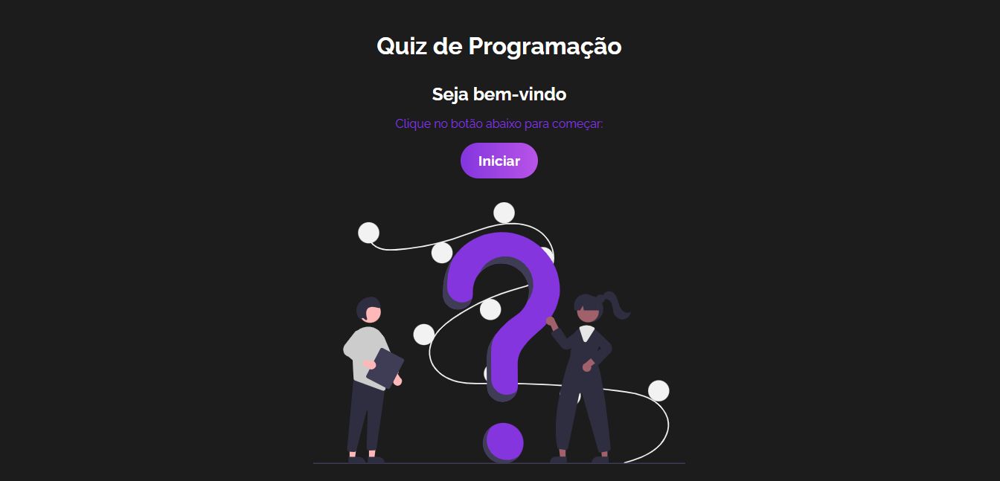

# Projeto: Quiz em React

Esse projeto é um quiz de programação baseado em React, mas o JavaSript puro também é implementado em muitas funcionalidades. 
No clique do botão "Iniciar", o jogo é iniciado.  
  
Podemos escolher uma das três categorias disponíveis no jogo: 
HTML, CSS ou JAVASCRIPT.  
  
Ao escolher a categoria temos 4 opções de respostas, um botão de dica para a resposta certa e outro botão onde podemos eliminar uma resposta errada.
Os botões de "dica" e "excluir uma" são mutuamente excludentes, ou seja só é possível escolher uma das duas opções de ajuda.  
  
Ao clicar na resposta certa a sua área de input recebe a cor verde e as respostas erradas recebem a cor vermelha em sua área de input.  
  
No fim do jogo é exibido na tela uma mensagem com o total de acertos para às cinco perguntas e também fica disponível o botão para reiniciar o jogo novamente.   
  
### TECNOLOGIAS:
- HTML 
- CSS 
- REACT 
- JAVASCRIPT 
- GIT/GITHUB 

